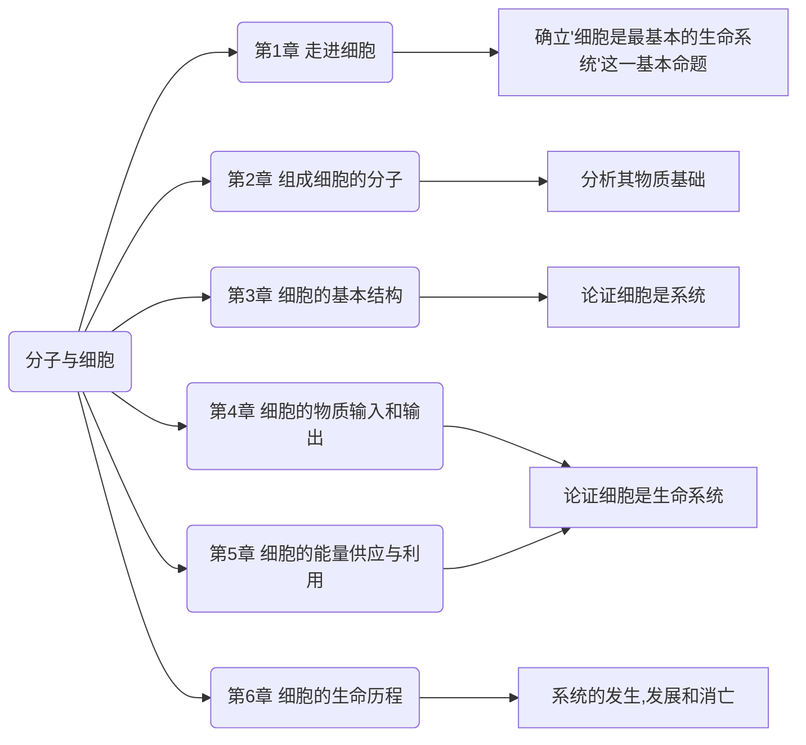

<b>系统：</b>相互作用，相互依赖的<u>组成成分</u>有规律的结合形成的<u>整体</u>。

## 章节概述

```mermaid
graph LR;
	J(分子与细胞) --> A;
	J(分子与细胞) --> C;
	J(分子与细胞) --> E;
	J(分子与细胞) --> G;
	J(分子与细胞) --> K;
	J(分子与细胞) --> L;
	A(第1章 走进细胞) --> B[确立'细胞是最基本的生命系统'这一基本命题];
	C(第2章 组成细胞的分子) --> D[分析其物质基础];
	E(第3章 细胞的基本结构) --> F[论证细胞是系统];
	G(第4章 细胞的物质输入和输出) --> H[论证细胞是生命系统];
	K(第5章 细胞的能量供应与利用) --> H;
	L(第6章 细胞的生命历程) --> M[系统的发生,发展和消亡];
```
